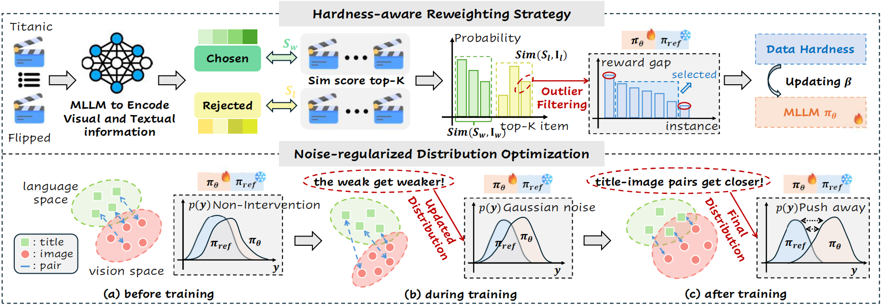

# HaNoRec
Multimodal Large Language Models with Adaptive Preference Optimization for Sequential Recommendation

# We’re working on releasing the code soon — Please stay tuned!

## Model Architecture


## 🧰 Environment Setup for HaNoRec

You can run the following command to download the codes faster:

```bash
conda create -y -n hanorec python=3.10
conda activate hanorec
pip install -r requirement.txt
```

## 💡 Dataset Structure and Download

You can download multimodal recommendation files in the following datasets:

**Microlens**/ **Netflix**/ **Movielens** [[Google Drive]](https://drive.google.com/file/d/1hYlIN6qt7vnzCd4ZwBSFkvMBeqo63d4b/view)

Each dataset consists of a training set, a validation set, and a test set. During the training process, we utilize the validation set to determine when to stop the training in order to prevent overfitting.

```plaintext
- microlens (netflix/movielens)
|--- dataset_pairs #  user-item pairs
|--- dataset_titles #  item titles
|--- train/val/test.tsv # training/validation/test set
|--- train/val/test_sft_1 # training/validation/test for MLLM SFT (HR@1)
|--- train/val/test_sft_3 # training/validation/test for MLLM SFT (HR@3 && NDCG@3)
```
