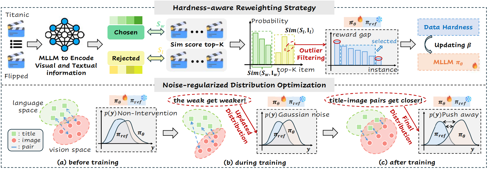

# HaNoRec
Multimodal Large Language Models with Adaptive Preference Optimization for Sequential Recommendation

## Model Architecture


## 🧰 Environment Setup for HaNoRec

You can run the following command to download the codes faster:

```bash
conda create -y -n hanorec python=3.10
conda activate hanorec
pip install -r requirement.txt
```

## 💡 Dataset Structure and Download

You can download multimodal recommendation files in the following datasets:

**Microlens**/ **Netflix**/ **Movielens** [[Google Drive]](https://drive.google.com/file/d/1hYlIN6qt7vnzCd4ZwBSFkvMBeqo63d4b/view)

Each dataset consists of a training set, a validation set, and a test set. During the training process, we utilize the validation set to determine when to stop the training in order to prevent overfitting.

```plaintext
- microlens (netflix/movielens)
|--- dataset_pairs #  user-item pairs
|--- dataset_titles #  item titles
|--- train/val/test.tsv # training/validation/test set
|--- train/val/test_sft_1 # training/validation/test for MLLM SFT (HR@1)
|--- train/val/test_sft_3 # training/validation/test for MLLM SFT (HR@3 && NDCG@3)
```

> [!NOTE]
> The architecture tag above expects `model.png` at the repository root. Add the paper architecture figure with that filename when preparing a release; it is not included in the current working tree.

## Overview

HaNoRec improves multimodal sequential recommendation in two stages. First, Qwen2.5-VL is supervised on the current recommendation data to obtain a task-specific LoRA adapter. Second, the SFT samples are converted into deterministic preference pairs and optimized with HaNoRec, which combines Hardness-aware Reward Scaling (HaRS) and Noise-Driven Optimization (NoDO).

```text
Current TSV, titles, images, and SFT JSON
    -> Qwen2.5-VL supervised fine-tuning
    -> chosen/rejected preference construction
    -> multimodal catalog encoding and Top-K retrieval
    -> offline HaRS sample hardness
    -> HaNoRec DPO with dynamic per-sample beta and NoDO
```

The implementation supports two tasks:

| Argument | Task | Evaluation |
|---|---|---|
| `--hit 1` | Binary Yes/No next-item preference | AUC |
| `--hit 3` | Top-3 next-item ranking | HR@3 and NDCG@3 |

Run all commands from the repository root.

## Repository Layout

The relevant files are organized as follows:

```text
.
|--- Qwen-2.5-VL-3B-Instruct/        # local multimodal base model
|--- data/<dataset>/                 # current source data; treated as read-only
|--- checkpoints/<dataset>/
|    |--- sft_1_lora_qwenvl/         # SFT adapter for the binary task
|    `--- sft_3_lora_qwenvl/         # SFT adapter for the ranking task
|--- artifacts/hanorec/<dataset>/    # generated preferences, embeddings, and hardness
|--- configs/hanorec/                # six HaNoRec training configurations
|--- hanorec/                        # HaRS, NoDO, data, and trainer implementation
|--- scripts/prepare_hanorec.py      # offline preference and hardness preparation
`--- scripts/train_hanorec.py        # end-to-end HaNoRec entry point
```

The current repository already contains the six SFT adapter directories expected by the HaNoRec configurations. If you use these adapters, you may go directly to [HaNoRec data preparation](#stage-2-prepare-hanorec-preference-data-and-hars-hardness).

## Stage 1: Supervised Fine-Tuning

### 1.1 Prepare SFT data

For each dataset and task, the multimodal SFT files used by this repository follow these names:

```text
data/<dataset>/train-mllm_sft_<hit>.json
data/<dataset>/val-mllm_sft_<hit>.json
data/<dataset>/test-mllm_sft_<hit>.json
```

Each JSON sample contains a user/assistant conversation and the associated item image paths. Keep the TSV files, title CSV files, image directories, and SFT JSON files together under `data/<dataset>/`.

### 1.2 Train an SFT adapter

HaNoRec expects the SFT adapter at:

```text
checkpoints/<dataset>/sft_<hit>_lora_qwenvl
```

The repository includes `train/mllm_sft.sh` as the original SFT recipe. Before using it on another machine, update its Conda activation path, `PYTHONPATH`, model path, dataset name, dataset directory, and output directory. The legacy SFT entries at `LLaMA-Factory/data/dataset_info.json` also contain the original `/data/wy/MLLMRec/...` paths; change their `file_name` values to your current absolute paths or repository-relative paths, for example:

```json
"file_name": "../../data/microlens/train-mllm_sft_1.json"
```

After selecting the dataset and task in the script, run:

```bash
bash train/mllm_sft.sh
```

A portable equivalent can be launched directly through the bundled LLaMA-Factory after fixing the corresponding dataset registration:

```bash
REPO_ROOT="$(pwd)"
DATASET="microlens"
HIT="1"

export PYTHONPATH="${REPO_ROOT}/LLaMA-Factory/src:${PYTHONPATH}"

python -m llamafactory.cli train \
  --stage sft \
  --do_train true \
  --model_name_or_path "${REPO_ROOT}/Qwen-2.5-VL-3B-Instruct" \
  --dataset_dir "${REPO_ROOT}/LLaMA-Factory/data" \
  --dataset "${DATASET}_vl_train_sft_${HIT}" \
  --template qwen2_vl \
  --finetuning_type lora \
  --lora_target all \
  --lora_rank 8 \
  --lora_alpha 32 \
  --lora_dropout 0.05 \
  --cutoff_len 4096 \
  --per_device_train_batch_size 2 \
  --gradient_accumulation_steps 8 \
  --learning_rate 1e-4 \
  --num_train_epochs 5 \
  --lr_scheduler_type cosine \
  --bf16 true \
  --report_to none \
  --output_dir "${REPO_ROOT}/checkpoints/${DATASET}/sft_${HIT}_lora_qwenvl" \
  --trust_remote_code true
```

To use validation-based stopping when reproducing SFT, register the corresponding `val-mllm_sft_<hit>.json` file in `dataset_info.json`, pass it as the evaluation dataset, and configure the desired evaluation and checkpoint-selection strategy.

## Stage 2: Prepare HaNoRec Preference Data and HaRS Hardness

Preparation is offline and does not modify the current source data. For example:

```bash
python scripts/train_hanorec.py --dataset microlens --hit 1 --prepare-only
```

This command performs the following operations:

1. Aligns each current SFT sample with its TSV target item IDs.
2. Builds deterministic `chosen` and `rejected` responses.
3. Rewrites legacy image paths only inside the derived samples so they point to the current repository images.
4. Encodes item titles and images with the local Qwen2.5-VL model.
5. Fuses normalized text and visual embeddings and retrieves Top-K neighbors.
6. Computes and attaches the offline HaRS hardness value for every preference pair.

To inspect the commands without loading the model, use:

```bash
python scripts/train_hanorec.py --dataset microlens --hit 1 --dry-run
```

You may also invoke the preparation wrapper directly:

```bash
python scripts/prepare_hanorec.py \
  --dataset microlens \
  --hit 1 \
  --top-k 10 \
  --model Qwen-2.5-VL-3B-Instruct
```

Prepared files are stored under `artifacts/hanorec/<dataset>/`. A typical output set is:

```text
artifacts/hanorec/microlens/
|--- train-mllm_dpo_1.json
|--- catalog_embeddings.npz
|--- catalog_embeddings.manifest.json
|--- neighbors-k10.json
|--- train-mllm_hanorec_1.json
`--- train-mllm_hanorec_1.manifest.json
```

Existing derived files are not overwritten by default. Use `--force-prepare` when the source files, encoder model, Top-K value, or task has changed:

```bash
python scripts/train_hanorec.py \
  --dataset microlens \
  --hit 3 \
  --force-prepare
```

Because catalog embeddings are shared by both tasks of the same dataset and their manifests validate all referenced item IDs, switching between `--hit 1` and `--hit 3` may require `--force-prepare` the first time.

## Stage 3: Train HaNoRec

The main entry point prepares missing artifacts and then launches HaNoRec DPO through the bundled LLaMA-Factory:

```bash
python scripts/train_hanorec.py --dataset microlens --hit 1
```

All supported configurations can be launched with:

```bash
# Microlens
python scripts/train_hanorec.py --dataset microlens --hit 1
python scripts/train_hanorec.py --dataset microlens --hit 3

# Netflix
python scripts/train_hanorec.py --dataset netflix --hit 1
python scripts/train_hanorec.py --dataset netflix --hit 3

# Movielens
python scripts/train_hanorec.py --dataset movielens --hit 1
python scripts/train_hanorec.py --dataset movielens --hit 3
```

If the HaRS artifacts already exist and their manifests are current, skip offline preparation:

```bash
python scripts/train_hanorec.py \
  --dataset microlens \
  --hit 1 \
  --skip-prepare
```

The original multimodal entry point dispatches to the same pipeline:

```bash
python main_mllm.py \
  --do_train \
  --training_mode dpo \
  --dataset microlens \
  --hit 1
```

## HaNoRec Components

### HaRS: Hardness-aware Reward Scaling

HaRS estimates preference difficulty from the difference between the positive and negative items' multimodal Top-K neighborhood distributions. The offline hardness is combined with the model responsiveness of the current global mini-batch to produce a per-example DPO coefficient:

```text
beta_i = beta_0 * responsiveness * hardness_i
```

The responsiveness calculation gathers reward gaps across distributed workers and removes the largest and smallest normalized gaps, so the effective global mini-batch must contain at least three examples.

### NoDO: Noise-Driven Optimization

NoDO samples Gaussian perturbations for the active LoRA A/B modules during each policy training forward pass. Forward hooks implement the perturbed matrix products without modifying the stored LoRA parameters. Hooks are always removed after the forward pass, and reference-model and evaluation forwards remain unperturbed.

## Paper-Aligned Training Defaults

The six files under `configs/hanorec/` define the current training recipes:

| Parameter | Value |
|---|---|
| Base model | `Qwen-2.5-VL-3B-Instruct` |
| SFT adapter | `checkpoints/<dataset>/sft_<hit>_lora_qwenvl` |
| Preference loss | Sigmoid DPO |
| Base beta | `0.1` |
| LoRA rank / alpha / dropout | `8 / 32 / 0.05` |
| Learning rate | `1e-4` |
| Epochs | `5` |
| Per-device mini-batch | `4` with `dataloader_drop_last: true` |
| Gradient accumulation | `8` |
| Default Top-K | `10` |
| Microlens NoDO sigma | `0.05` |
| Netflix/Movielens NoDO sigma | `0.1` |

The SFT adapter is loaded as the task-specific starting point and a fresh rank-8 DPO LoRA adapter is trained. Output adapters are written to:

```text
checkpoints/<dataset>/hanorec_<hit>_lora_qwenvl
```

## Useful Options

| Option | Purpose |
|---|---|
| `--dry-run` | Print preparation and training commands without executing them. |
| `--prepare-only` | Build preferences and HaRS artifacts without starting DPO. |
| `--skip-prepare` | Reuse existing derived artifacts and start training directly. |
| `--force-prepare` | Rebuild existing preferences, embeddings, neighbors, and hardness. |
| `--top-k K` | Change the offline retrieval neighborhood size. |
| `--config PATH` | Train with a custom HaNoRec YAML configuration. |
| `--device-map VALUE` | Select the encoder model device mapping used during preparation. |

## Data Safety and Reproducibility

- Files under `data/<dataset>/` are read-only inputs to the HaNoRec preparation pipeline.
- All generated preferences, embeddings, neighbors, hardness values, and manifests are written under `artifacts/hanorec/<dataset>/`.
- Derived JSON and NumPy artifacts use temporary files followed by atomic replacement.
- Existing artifacts are protected from accidental overwrite unless a force option is supplied.
- Embedding manifests fingerprint the encoder model, title file, image-directory metadata, and referenced item IDs to reject stale caches.
- Preference construction is deterministic for a fixed seed. The default seed is `2025`.

## Validation

Run the dependency-light test suite from the repository root:

```bash
python -m unittest discover -s tests -t . -p "test_*.py" -v
```

The PyTorch/PEFT hook integration tests run automatically when PyTorch is installed. They are reported as skipped in lightweight environments without PyTorch. Full Qwen2.5-VL encoding and 3B-model training require a CUDA-capable environment with the dependencies from `requirement.txt`.

For additional implementation details, artifact descriptions, and troubleshooting commands, see [`HANOREC.md`](HANOREC.md).
